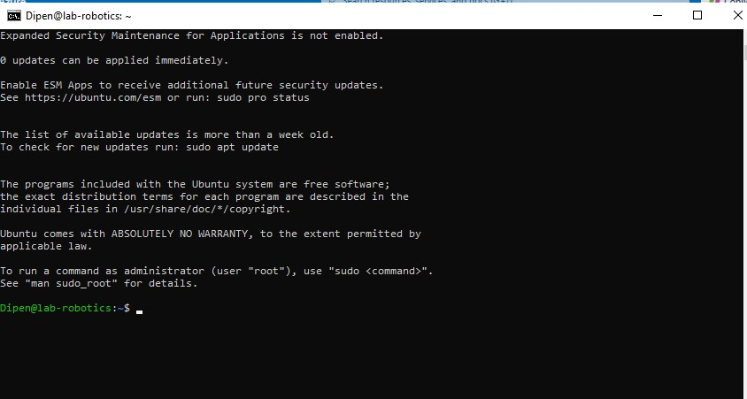
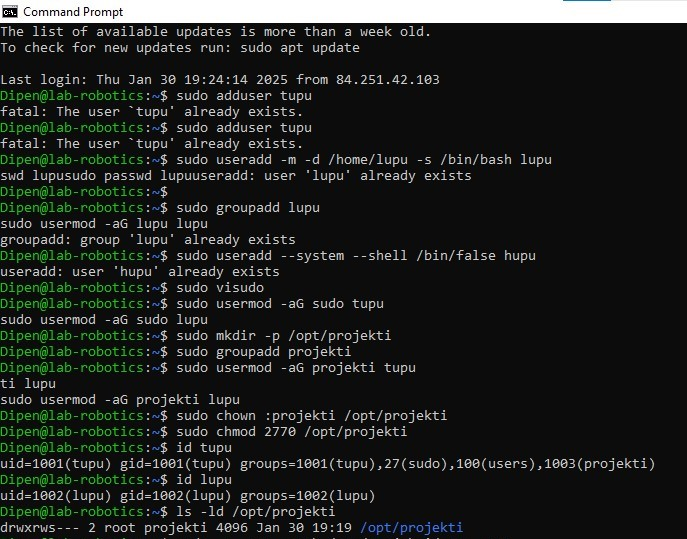
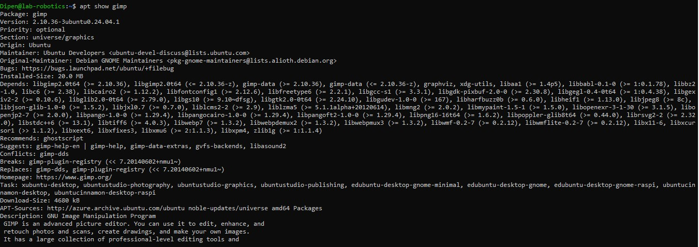
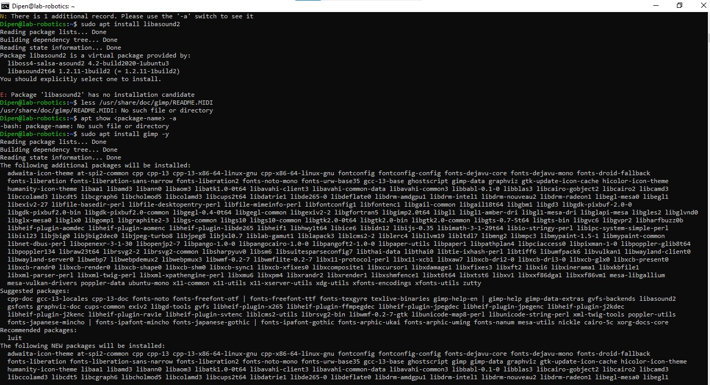

# Linux

Account Setup
In the first step, I have created a Microsoft Azsure account using our university email address. Then, my microsoft azsure account is successfully created and I have recevied $100 worth of credit which helps me to purchase different types of useful learning environment.

## Create Virtual Machine
I have created a virtual machine where I can learn and do some projects for this course.
Then, I named the machine "lab-robotics" and then I have select the no infrastructure redundancy required option and Trusted launch virtual machines security type.
I choosed Ubuntu Server 24.04 LTS - x64 Gen2 server and B series version 2 which is Standard_B21s_v2.
After completing all the steps, I got a key and I have selected the connect option and choose the native ssh option.
There is a copy and execute SSH command button, I have pasted the key which I have got earlier.
Then open the windows powershell and paste the link generated link there and I reached in the Linux virtual machine.
It help us to use Linux in windows laptop without installing it.

### *Linking my GitHub account to my HAMK email*
I created a new repository named "Linux" for the assignment.
Then I linked my HAMK email as a secondary mail for version control.

**screenshoot**

# # Assignment  3
## User Management and File System access
I have created user accounts on my Linux system to manage access 
and permissions.

First, I created a user named tupu by running the sudo adduser tupu command.
This automatically created the home directory /home/tupu, set /bin/bash as 
the default shell, and prompted for a password setup.

Then, I created another user lupu using sudo 
useradd -m -d /home/lupu -s /bin/bash -G lupu lupu. 
This command manually set the home directory,
assigned /bin/bash as the default shell, and
added lupu to the lupu group. After that, 
I set a password for lupu using sudo passwd lupu.

Next, I added a system user hupu with restricted access 
using sudo useradd --system --shell /bin/false hupu. 
This prevents hupu from logging in interactively.

To grant administrative privileges, I opened the 
sudoers file using sudo visudo and added the following
lines at the end:

        tupu ALL=(ALL:ALL) ALL  
        lupu ALL=(ALL:ALL) ALL

Alternatively, I could add both users to the sudo group using:

        sudo usermod -aG sudo tupu  
        sudo usermod -aG sudo lupu  

To verify their group memberships, I used groups tupu and groups lupu.

Then, I set up a shared directory for tupu and lupu. First, I created a
directory using sudo mkdir /opt/projekti. Then, I created a group named 
projekti using sudo groupadd projekti and added both users to it with:

        sudo usermod -aG projekti tupu  
        sudo usermod -aG projekti lupu  

After that, I changed the group ownership of the directory using sudo chown
:projekti /opt/projekti and modified the permissions with sudo chmod 770 /opt/projekti, 
ensuring that only tupu and lupu could access and modify files.

To make sure all new files inside /opt/projekti inherit the projekti group, 
I applied sudo chmod g+s /opt/projekti.

Finally, I verified my setup by running groups tupu, groups lupu, and checking
the directory permissions using ls -ld /opt/projekti. The expected output was:

        drwxrws--- 2 root projekti 4096 Jan 30 18:37 /opt/projekti  

### screenshoot

# Assignment 6(APT)

## 1. Checking  system’s APT version:
Run the following command to display the installed APT version:

                apt --version

Output :

                apt 2.7.14 (amd64)

## 2. Update the package list:

Run the command:
                
                sudo apt update

output:

                                Hit:1 http://azure.archive.ubuntu.com/ubuntu noble InRelease
                                Hit:2 http://azure.archive.ubuntu.com/ubuntu noble-updates InRelease
                                Hit:3 http://azure.archive.ubuntu.com/ubuntu noble-backports InRelease
                                Hit:4 http://azure.archive.ubuntu.com/ubuntu noble-security InRelease
                                Reading package lists... Done
                                Building dependency tree... Done
                                Reading state information... Done
                                All packages are up to date.

Explain of why this step is important:

The sudo apt update command is essential 
because it refreshes the system’s package 
list by retrieving the latest information 
from the configured repositories. This ensures 
that APT is aware of the newest available versions
of software and dependencies. Running this command
helps prevent installation issues that may occur if
the package list is outdated. It also synchronizes
repository data, allowing the system to fetch security
patches, bug fixes, and software updates. Additionally,
it is a necessary step before running sudo apt upgrade
to ensure that all installed packages can be updated to
their latest versions. Regularly updating the package list
helps maintain system stability and security.

## 3. Upgrade installed packages:

Run:

                sudo apt upgrade -y

What is the difference between update and upgrade?

Difference between update and upgrade:
update refreshes the package list without installing anything.
upgrade installs the latest versions of the installed packages.

## 4. View pending updates (if any):

Run:

                apt list --upgradable

Output: 

                Listing... Done

##  *Part 2: Installing & Managing Packages (20 min)*
### Search for a package using APT:
Find an image editor using:

                apt search image editor

From the packages I choose GIMP package.

## 6. View package details:

Get detailed information about the selected package:
                
                apt show gimp

What dependencies does it require?
The output of dependencies required by the packages are given below:

                 libgimp2.0t64 (>= 2.10.36), libgimp2.0t64 (<= 2.10.36-z), 
                 gimp-data (>= 2.10.36), gimp-data (<= 2.10.36-z), graphviz, 
                 xdg-utils, libaa1 (>= 1.4p5), libbabl-0.1-0 (>= 1:0.1.78), 
                 libbz2-1.0, libc6 (>= 2.38), libcairo2 (>= 1.12.2), libfontconfig1 
                 (>= 2.12.6), libfreetype6 (>= 2.2.1), libgcc-s1 (>= 3.3.1), 
                 libgdk-pixbuf-2.0-0 (>= 2.30.8), libgegl-0.4-0t64 (>= 1:0.4.38), 
                 libgexiv2-2 (>= 0.10.6), libglib2.0-0t64 (>= 2.79.0), 
                 libgs10 (>= 9.10~dfsg), libgtk2.0-0t64 (>= 2.24.10), 
                 libgudev-1.0-0 (>= 167), libharfbuzz0b (>= 0.6.0), 
                 libheif1 (>= 1.13.0), libjpeg8 (>= 8c), libjson-glib-1.0-0 (>= 1.5.2), 
                 libjxl0.7 (>= 0.7.0), liblcms2-2 (>= 2.9), liblzma5 (>= 5.1.1alpha+20120614), 
                 libmng2 (>= 2.0.2), libmypaint-1.5-1 (>= 1.5.0), libopenexr-3-1-30 (>= 3.1.5), 
                 libopenjp2-7 (>= 2.0.0), libpango-1.0-0 (>= 1.29.4), 
                 libpangocairo-1.0-0 (>= 1.29.4), libpangoft2-1.0-0 (>= 1.29.4), 
                 libpng16-16t64 (>= 1.6.2), libpoppler-glib8t64 (>= 0.44.0), 
                 librsvg2-2 (>= 2.32.0), libstdc++6 (>= 13.1), libtiff6 (>= 4.0.3), 
                 libwebp7 (>= 1.3.2), libwebpdemux2 (>= 1.3.2), libwebpmux3 (>= 1.3.2),
                  libwmf-0.2-7 (>= 0.2.12), libwmflite-0.2-7 (>= 0.2.12), libx11-6, 
                  libxcursor1 (>> 1.1.2), libxext6, libxfixes3, libxmu6 (>= 2:1.1.3), 
                  libxpm4, zlib1g (>= 1:1.1.4)

## Install the package:

Run:

                sudo apt install gimp -y

After running this command the package is successfully installed.

output:

                        Download-Size: 4680 kB
                        APT-Manual-Installed: yes
                        APT-Sources: http://azure.archive.ubuntu.com/ubuntu noble-updates/universe amd64 Packages
                        Description: GNU Image Manipulation Program

## Check installed package version:

Run:

                apt list --installed | grep gimp

output: 

                        gimp-data/noble-updates,now 2.10.36-3ubuntu0.24.04.1 all [installed,automatic]
                        gimp/noble-updates,now 2.10.36-3ubuntu0.24.04.1 amd64 [installed]
                        libgimp2.0t64/noble-updates,now 2.10.36-3ubuntu0.24.04.1 amd64 [installed,automatic]

What version was installed?
The installed version of GIMP is 2.10.36-3ubuntu0.24.04.1.

## *Part 3: Removing & Cleaning Packages (10 min)*
Uninstall the package:

Run:

                sudo apt remove gimp -y

Output:

                        The following packages will be REMOVED:
                        gimp
                        0 upgraded, 0 newly installed, 1 to remove and 0 not upgraded.
                        After this operation, 20.0 MB disk space will be freed.
                        (Reading database ... 115834 files and directories currently installed.)
                        Removing gimp (2.10.36-3ubuntu0.24.04.1) ...
                        Processing triggers for man-db (2.12.0-4build2) ...

Is the package fully removed?

Yes the package is removed.

## 11. Remove configuration files as well:

Run:

                        sudo apt purge gimp -y

What is the difference between remove and purge?

-remove: Uninstalls the package but keeps its configuration files.

-purge: Uninstalls the package and deletes its configuration files.
purge is generally used when you want to do a more complete uninstallation.

## Clear unnecessary package dependencies:
Run:

                sudo apt autoremove -y

Why is this step important?

Running sudo apt autoremove -y is an important step because 
it ensures that our system is free from unnecessary packages,
 frees up disk space, and helps maintain system stability and performance.

## 12.Clean up downloaded package files:
Run:

                        sudo apt clean

What does this command do?
The sudo apt clean command is used to remove all downloaded package files 
from the local cache, freeing up disk space while having no effect on the 
actual installed packages.

## *Part 4: Managing Repositories & Troubleshooting (15 min)*
## 13. List all APT repositories:
Run:

                        cat /etc/apt/sources.list

What do you notice in this file?

The  /etc/apt/sources.list  file does not contain any 
active package repositories. Instead, it includes comments 
indicating that Ubuntu has moved repository management to a 
new file located at /etc/apt/sources.list.d/ubuntu.sources, 
which uses the deb822 format. This file serves as a reference, 
and the actual repository configurations are now maintained in 
separate files in the /etc/apt/sources.list.d/ directory.

## 14. Add a new repository (example: universe repository):
Run:

                sudo add-apt-repository universe
                sudo apt update

What types of packages are found in the universe repository?

The universe repository in Ubuntu contains community-supported packages,
including open-source software, third-party tools, older versions of packages,
and non-essential software. It offers a wide range of applications such as development
tools, programming libraries, games, multimedia software, and utilities. These packages
are maintained by the community rather than Canonical and typically receive less official
support or testing compared to those in the main repository.

## 15. Simulate an installation failure and troubleshoot:
Try installing a non-existent package:

                        sudo apt install fakepackage

Output:

                        Reading package lists... Done
                        Building dependency tree... Done
                        Reading state information... Done
                        E: Unable to locate package fakepackage

What error message do you get?

The error message I receive is:

                E: Unable to locate package fakepackage

How would you troubleshoot this issue?

To troubleshoot the "E: Unable to locate package 
fakepackage" error, first, verify the package name to 
ensure it’s correctly spelled, as a typo can cause this issue.
Then, run sudo apt update to refresh your local package index 
and ensure that your system has the latest package lists from 
the repositories. If the package still cannot be found, check 
whether the repository containing the package is enabled by 
reviewing your sources list (via cat /etc/apt/sources.list). 
You can also use apt search <gimp> to check if the package 
exists in the repositories. If the package isn't available, it might 
not be included in your version of Ubuntu, or it could be found in a 
different repository or a Personal Package Archive (PPA). In such cases, 
you may need to add the relevant PPA or search for an alternative installation method.

## Bonus Challenge (Optional):

Use apt-mark to hold and unhold a package so it doesn't get updated.

                        sudo apt-mark hold gimp
                        sudo apt-mark unhold gimp

Why would you want to hold a package?

I would want to hold a package to prevent it from being automatically 
updated because certain updates could cause compatibility issues, break 
my custom configurations, or introduce bugs. By holding a package, I can ensure 
that I’m using a specific version that works well with my system or software requirements,
which helps me maintain stability and control over my setup.
 

## some screenshoot:
 
 

