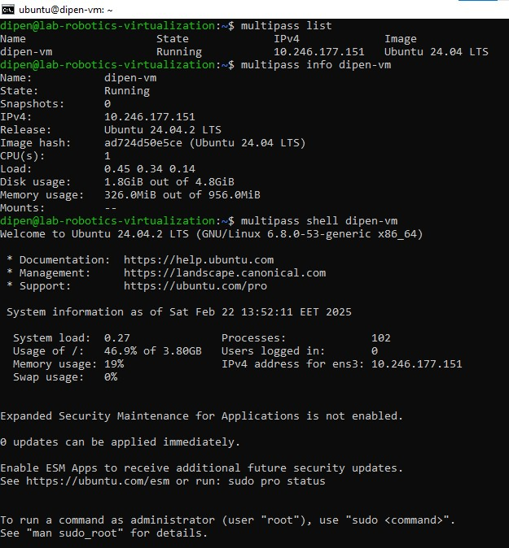
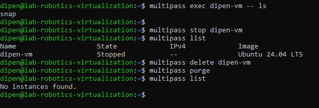

# Assignment 7 - Virtualization  

## **Part 1: Introduction to Virtualization**  

### **Research on Key Concepts**  

#### **1. Virtualization**  
Virtualization is the process of creating a software-based (or virtual) version of a computer system, including hardware platforms, storage devices, and network resources. It enables multiple operating systems to run on a single physical machine.  

#### **2. Hypervisor**  
A hypervisor, also known as a Virtual Machine Monitor (VMM), is software that creates and manages virtual machines (VMs). It allows multiple VMs to run on a single physical host by distributing resources efficiently.  
- **Type 1 (Bare-metal Hypervisor):** Runs directly on the host hardware (e.g., VMware ESXi, Microsoft Hyper-V, KVM).  
- **Type 2 (Hosted Hypervisor):** Runs on a host operating system (e.g., VirtualBox, VMware Workstation).  

#### **3. Virtual Machines (VMs)**  
A virtual machine (VM) is an emulation of a computer system. It runs its own operating system and applications just like a physical computer. Each VM has its own virtual CPU, RAM, storage, and network interface but operates independently from the host system.  

#### **4. Containers**  
Containers are lightweight, standalone, and executable software packages that include everything needed to run an application (code, runtime, libraries). Unlike VMs, containers share the host OS kernel, making them faster and more resource-efficient. Examples include Docker and LXC.  

#### **5. Differences Between VMs and Containers**  

| Feature | Virtual Machines (VMs) | Containers |
|---------|----------------------|------------|
| **Architecture** | Full OS per VM | Shares host OS kernel |
| **Performance** | Slower due to overhead | Faster due to lightweight design |
| **Isolation** | Stronger security, full isolation | Less isolated, shares kernel |
| **Boot Time** | Minutes | Seconds |
| **Resource Usage** | Requires more memory & CPU | Uses less memory & CPU |
| **Use Case** | Best for running multiple OS | Best for microservices and scalable apps |

---

## **Summary**  
- **Virtual Machines** provide complete isolation and run separate operating systems but consume more resources.  
- **Containers** are lightweight, share the host OS kernel, and are ideal for running scalable applications with minimal overhead.  

## **Part 2: Working with Multipass**
 I used the following commands for part 2:
 ### **Step 1: Install Multipass**
        
            sudo snap install multipass

screenshot:

### **Step 2: Test Multipass Commands**

1. Launch a default Ubuntu instance

        multipass launch --name dipen-vm

2. Show running instances

            multipass list

3. Show instance details

        multipass info dipen-vm

4. Access instance shell

         multipass shell dipen-vm

screenshot:

5. Run command inside instance

         multipass exec dipen-vm -- ls

6. Stop instance

        multipass stop dipen-vm

7. Delete instance

         multipass delete dipen-vm

8. Clean up deleted instances

            multipass purge

screenshot:

### **Step 3: Cloud-Init Configuration**

1. Create a file named cloud-init.yaml:

        nano cloud-init.yaml

screenshot:

2. Launch an instance with cloud-init

        multipass launch --name dipen-vm --cloud-init cloud-init.yaml

    
3. Create a new folder and Mount the folder inside a VM:

        mkdir -p ~/multipass-share
        multipass mount ~/multipass-share dipen-vm:/mnt/shared

4. Verify the shared folder inside the Multipass instance

        multipass shell dipen-vm
        ls /mnt/shared

5.  create a test file in the shared folder

        echo "Hello from Multipass" > /mnt/shared/testfile.txt

6. Check if the file appears on the host

        ls ~/multipass-share

7. Unmount the shared folder after done

        multipass umount dipen-vm:/mnt/shared

screenshoot:

## **Part 3: Exploring LXD**

### **Step 1: Install LXD**
        sudo snap install lxd

### **Step 2: Initialize LXD**
        lxd init

### **Step 3: Create and Manage Containers**

1. Launch a new LXD container

            lxc launch ubuntu:24.04 my-container

2. List running containers

            lxc list

screenshot:

3. Enter the container shell

            lxc exec my-container -- bash

4. Run a command inside the container

            cat /etc/os-release

5. Exit the container
         
           exit

6.  Stop the container

            lxc stop my-container

7. Delete the container

            lxc delete my-container

screenshoot:

## **Part 4: Stick Apps with Docker**

I understand the basic concept of docker by visiting the site:

### **Installation of docker in Linux**

        curl -fsSL https://get.docker.com -o get-docker.sh

checking version for verification:

### **Experiment with Docker**

1. Check if Docker is working by running a test container:              

                sudo docker run hello-world

2. List running containers:

                sudo docker ps -a

3. Pull an official image:

                sudo docker pull nginx

